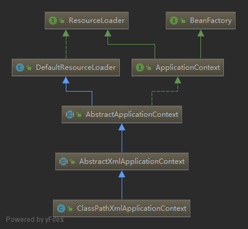

**先太监了 一下午没写完.. 今后有时间再补充  我找到了一个描述Spring IOC的帖子可以看看 https://javadoop.com/post/spring-ioc**


**事先声明:** 以下所有内容都是基于xml的配置的方式进行讲解的,为了降低理解IOC和AOP的难度。Spring Boot加载Spring的方式以后会补充Spring Boot将解析中。  
**阅读建议:** 阅读者要对Spring有一定的认知。 现在的spring源码规模太大了,如果想要自己学的话,可以下载如下项目进行摸索: https://github.com/code4craft/tiny-spring

**源码分析将从如下入口开始:**
```
// 位于demo.src.test.java.com.example.demo.context.ApplicationContextTest#analysis()
ApplicationContext applicationContext = new ClassPathXmlApplicationContext(new String[] {"spring-config.xml"}, true, null);
HelloService helloService = (HelloService) applicationContext.getBean("helloService");
helloService.sayHello();
```
首先我们先看第一行 `ApplicationContext applicationContext = new ClassPathXmlApplicationContext(...);` 的操作。  
通过引用可以看出这是一个创建ApplicationContext的过程。代码通过调用ClassPathXmlApplicationContext的构造函数来返回一个ApplicationContext。  

这里我先引入一张类关系图(该图片是我简化过后的,原图太复杂了...)  
  

该图片是我处理过后的ClassPathXmlApplicationContext的类关系图。可以使用IDEA的`Ctrl + Alt + Shift + U`来操作出关系图。 

接上原来的话,我们得知ApplicationContext是通过ClassPathXmlApplicationContext的构造函数返回的。  
图中显示ApplicationContext和ClassPathXmlApplicationContext有继承关系,那么我们跟进构造函数中看一下。  
```
/**
* Create a new ClassPathXmlApplicationContext with the given parent, loading the definitions from the given XML files.
*/
public ClassPathXmlApplicationContext(String[] configLocations, 
      boolean refresh, @Nullable ApplicationContext parent) throws BeansException {
  // 通过注释、参数名称和我们传递的参数大致可以看出参数都是什么意思。我们确实没有父级别的ApplicationContext,所以parent穿的为null。
  // 这里就不去跟踪了,和我们这里讲的内容无关。(最终它是 设置一个parent属性 并 将环境和并.) 
  super(parent); 
  // 也不跟了。(就是将传入的configLocations传递给该对象实例的configLocations属性)  
  setConfigLocations(configLocations); 
  if (refresh) { // 可能会有疑惑`refresh`不能为false吗? 当然能,如果为false,上下文的构建就无法进行下去,最初3行程序执行也就会报错了
    refresh(); // 重点
  }
}
``` 

重点是`refresh()`方法,下面跟进去看一下。从这里开始就不再一行行描述了。   
```
public void refresh() throws BeansException, IllegalStateException {
    synchronized (this.startupShutdownMonitor) {
        // Prepare this context for refreshing.
        prepareRefresh();

        // Tell the subclass to refresh the internal bean factory.
        ConfigurableListableBeanFactory beanFactory = obtainFreshBeanFactory();

        // Prepare the bean factory for use in this context.
        prepareBeanFactory(beanFactory);

        try {
            // Allows post-processing of the bean factory in context subclasses.
            postProcessBeanFactory(beanFactory);

            // Invoke factory processors registered as beans in the context.
            invokeBeanFactoryPostProcessors(beanFactory);

            // Register bean processors that intercept bean creation.
            registerBeanPostProcessors(beanFactory);

            // Initialize message source for this context.
            initMessageSource();

            // Initialize event multicaster for this context.
            initApplicationEventMulticaster();

            // Initialize other special beans in specific context subclasses.
            onRefresh();

            // Check for listener beans and register them.
            registerListeners();

            // Instantiate all remaining (non-lazy-init) singletons.
            finishBeanFactoryInitialization(beanFactory);

            // Last step: publish corresponding event.
            finishRefresh();
        }

        catch (BeansException ex) {
            if (logger.isWarnEnabled()) {
                logger.warn("Exception encountered during context initialization - " +
                        "cancelling refresh attempt: " + ex);
            }

            // Destroy already created singletons to avoid dangling resources.
            destroyBeans();

            // Reset 'active' flag.
            cancelRefresh(ex);

            // Propagate exception to caller.
            throw ex;
        }

        finally {
            // Reset common introspection caches in Spring's core, since we
            // might not ever need metadata for singleton beans anymore...
            resetCommonCaches();
        }
    }
}
```

注意`ConfigurableListableBeanFactory beanFactory = obtainFreshBeanFactory();`这一行代码,通过obtainFreshBeanFactory()方法获取了个BeanFactory。

这里跟进去看一下。
```
/** Tell the subclass to refresh the internal bean factory. */
protected ConfigurableListableBeanFactory obtainFreshBeanFactory() {
    refreshBeanFactory();
    return getBeanFactory();
}
````

`getBeanFactory()`这个地方可以看一下,进到AbstractRefreshableApplicationContext的实现里面可以看到单纯的就是为了获取beanFactory。源码如下:
```
// 线程安全的
public final ConfigurableListableBeanFactory getBeanFactory() {
    synchronized (this.beanFactoryMonitor) {
        if (this.beanFactory == null) {
            throw new IllegalStateException("BeanFactory not initialized or already closed - " +
                    "call 'refresh' before accessing beans via the ApplicationContext");
        }
        return this.beanFactory;
    }
}
```

回到`obtainFreshBeanFactory()`再看一下`refreshBeanFactory()`仍然是进到AbstractRefreshableApplicationContext的实现里面。
```
protected final void refreshBeanFactory() throws BeansException {
    if (hasBeanFactory()) {
        destroyBeans();
        closeBeanFactory();
    }
    try {
        DefaultListableBeanFactory beanFactory = createBeanFactory();
        beanFactory.setSerializationId(getId());
        customizeBeanFactory(beanFactory);
	// 上面不管 注意下面这一行
        loadBeanDefinitions(beanFactory);
        synchronized (this.beanFactoryMonitor) {
            this.beanFactory = beanFactory;
        }
    }
    catch (IOException ex) {
        throw new ApplicationContextException("I/O error parsing bean definition source for " + getDisplayName(), ex);
    }
}
```
重点是`loadBeanDefinitions(beanFactory);`这个地方。跟进该方法,进入AbstractXmlApplicationContext的实现里面
```
protected void loadBeanDefinitions(DefaultListableBeanFactory beanFactory) throws BeansException, IOException {
    // Create a new XmlBeanDefinitionReader for the given BeanFactory.
    XmlBeanDefinitionReader beanDefinitionReader = new XmlBeanDefinitionReader(beanFactory); // 重点1

    // Configure the bean definition reader with this context's
    // resource loading environment.
    beanDefinitionReader.setEnvironment(this.getEnvironment());
    beanDefinitionReader.setResourceLoader(this);
    beanDefinitionReader.setEntityResolver(new ResourceEntityResolver(this));

    // Allow a subclass to provide custom initialization of the reader,
    // then proceed with actually loading the bean definitions.
    initBeanDefinitionReader(beanDefinitionReader);
    loadBeanDefinitions(beanDefinitionReader); // 重点2
}
```
**第一个重点方法区,这附近请仔细观看。**  
**重点1跟进。(主要是指定了一个资源加载器)**
```
protected AbstractBeanDefinitionReader(BeanDefinitionRegistry registry) {
    Assert.notNull(registry, "BeanDefinitionRegistry must not be null");
    this.registry = registry;

    // Determine ResourceLoader to use.
    if (this.registry instanceof ResourceLoader) {
        this.resourceLoader = (ResourceLoader) this.registry;
    }
    else {
       // 这里获取了一个资源加载器(ResourceLoader) 别管是哪个类的实例
        this.resourceLoader = new PathMatchingResourcePatternResolver();  
    }

    // other operates... 我删掉了,要不太长
}
```
**重点2跟进。** 
```
// 这个方法位于AbstractXmlApplicationContext类中
protected void loadBeanDefinitions(XmlBeanDefinitionReader reader) throws BeansException, IOException {
    Resource[] configResources = getConfigResources();
    if (configResources != null) {
        reader.loadBeanDefinitions(configResources);
    }
    String[] configLocations = getConfigLocations();
    if (configLocations != null) {
        reader.loadBeanDefinitions(configLocations); // 在我们最开始的代码中只配置了configLocations,所以进到这里,继续跟
    }
}

// 这里是上面 reader.loadBeanDefinitions(configLocations); 跟进后的方法 位于AbstractBeanDefinitionReader类中
public int loadBeanDefinitions(String... locations) throws BeanDefinitionStoreException {
    Assert.notNull(locations, "Location array must not be null");
    int count = 0;
    for (String location : locations) {
        count += loadBeanDefinitions(location); // 继续跟进
    }
    return count;
}

// 上面的跟进一直进行到这里为止  位于AbstractBeanDefinitionReader类中
public int loadBeanDefinitions(String location, @Nullable Set<Resource> actualResources) throws BeanDefinitionStoreException {
    ResourceLoader resourceLoader = getResourceLoader();
    // 这里有一些其他操作,省略掉

    if (resourceLoader instanceof ResourcePatternResolver) {
        // Resource pattern matching available.
        try {
            Resource[] resources = ((ResourcePatternResolver) resourceLoader).getResources(location);
            int count = loadBeanDefinitions(resources);
            // 这里有一些其他操作,省略掉
            return count;
        } catch (IOException ex) {
            throw new BeanDefinitionStoreException(
                    "Could not resolve bean definition resource pattern [" + location + "]", ex);
        }
    } else {
        // Can only load single resources by absolute URL.
        Resource resource = resourceLoader.getResource(location);
        int count = loadBeanDefinitions(resource);
        // ... 这里有一些其他操作,省略掉
        return count;
    }
}
```
该方法中有个 `if {..} else {..}` 不过不用管, 最终他们都是进到XmlBeanDefinitionReader#loadBeanDefinitions(Resource)方法中
```
// XmlBeanDefinitionReader#loadBeanDefinitions(Resource) 再跟进一步就是下面的这个方法
public int loadBeanDefinitions(EncodedResource encodedResource) throws BeanDefinitionStoreException {
    // 有一些操作..省略掉.
    try {
        InputStream inputStream = encodedResource.getResource().getInputStream();
        try {
            InputSource inputSource = new InputSource(inputStream);
            if (encodedResource.getEncoding() != null) {
                inputSource.setEncoding(encodedResource.getEncoding());
            }
            return doLoadBeanDefinitions(inputSource, encodedResource.getResource()); // 只有这一句是重点,那就跟进去
        } finally {
            inputStream.close();
        }
    } catch (IOException ex) {
        throw new BeanDefinitionStoreException(
                "IOException parsing XML document from " + encodedResource.getResource(), ex);
    } finally {
        currentResources.remove(encodedResource);
        if (currentResources.isEmpty()) {
            this.resourcesCurrentlyBeingLoaded.remove();
        }
    }
}

// 上面那一句重点跟进去是如下方法
protected int doLoadBeanDefinitions(InputSource inputSource, Resource resource) throws BeanDefinitionStoreException {
    try {
        // 这一步是将读取的xml文件流转为Document对象进行操作
        Document doc = doLoadDocument(inputSource, resource);
	// 这一步就是真正的注册BeanDefinition了
        int count = registerBeanDefinitions(doc, resource); // 跟进这一步
        if (logger.isDebugEnabled()) {
            logger.debug("Loaded " + count + " bean definitions from " + resource);
        }
        return count;
    }
    // 这里有很多catch块  省略掉.
}

// 上面的那一步跟进后的方法
public int registerBeanDefinitions(Document doc, Resource resource) throws BeanDefinitionStoreException {
    BeanDefinitionDocumentReader documentReader = createBeanDefinitionDocumentReader();
    int countBefore = getRegistry().getBeanDefinitionCount();
    // 只关注下面这一行   同时注意createReaderContext(resource),仅仅是留意一下这一句话就行
    
    documentReader.registerBeanDefinitions(doc, createReaderContext(resource)); // 跟进去
    return getRegistry().getBeanDefinitionCount() - countBefore;
}

// 从上面哪一个方法跟进去后,就开始再DefaultBeanDefinitionDocumentReader类中左右横跳,一直找到这个方法
protected void processBeanDefinition(Element ele, BeanDefinitionParserDelegate delegate) {
    BeanDefinitionHolder bdHolder = delegate.parseBeanDefinitionElement(ele);
    if (bdHolder != null) {
        bdHolder = delegate.decorateBeanDefinitionIfRequired(ele, bdHolder);
        try {
	    // Register the final decorated instance.
	    // 整个方法只关注如下这一行   这里的 getReaderContext() 就是上面的 createReaderContext(...) 搞出来的东西
            BeanDefinitionReaderUtils.registerBeanDefinition(bdHolder, getReaderContext().getRegistry());
        }
        catch (BeanDefinitionStoreException ex) {
            getReaderContext().error("Failed to register bean definition with name '" +
                    bdHolder.getBeanName() + "'", ele, ex);
        }
        // Send registration event.
        getReaderContext().fireComponentRegistered(new BeanComponentDefinition(bdHolder));
    }
}
```
跟进一次你就会看到`registry.registerBeanDefinition(beanName, definitionHolder.getBeanDefinition());`这样一行代码,你可以自己调试一下,这里直接说明这个registry是DefaultListableBeanFactory类。  
**一定要跟进到DefaultListableBeanFactory类看一下**,你就会看到如下的一行代码`this.beanDefinitionMap.put(beanName, beanDefinition);`。  
这个`beanDefinitionMap`我贴出来它是什么->`private final Map<String, BeanDefinition> beanDefinitionMap = new ConcurrentHashMap<>(256);`  
看到了吧,**Spring将读取的bean全部解析成BeanDefinition然后放到了一个Map里面.. (放在DefaultListableBeanFactory类的注册表中)** 

**到了这里做个小结**
**我们都做了什么？又到底跟踪了了什么？ 
我们进入了ClassPathXmlApplicationContext的构造函数看到有个refresh()方法,于是开始对该方法进行跟踪。  
在内部的obtainFreshBeanFactory()中,我们发现其内部创建了一个BeanFactory。  
还通过XmlBeanDefinitionReader构建了一个ResourceLoader对读取到的配置文件进行了解析,先是将xml读取成一个Resource,后又解析为Document,最终被解析为BeanDefinition注册到了前面创建的BeanFactory的注册表中。
那么问题来了 
1.BeanDefinition是啥？  
回答1: BeanDefinition其实可以理解为就是我们常说的bean,但是其没有初始化,仅仅是从xml文件拿出来配置了一些信息。   
2.Resource又是啥？ 
回答2:Resource就是对InputStream的封装。**  

一些补充: 
看到这里我没有发现BeanReference相关处理,不知道是我没找到还是在后面。(代码量超大..看得眼花)
BeanReference就是xml文件里面配置的ref属性,在getBean的时候,会根据该属性对要实例化的bean进行依赖注入(DI)  

**至此BeanDefinition就已经注册完成了**  

回到最上面的`refresh()`方法,看`prepareBeanFactory(beanFactory);`这行代码,就不贴出来了。  
其内部内容是: 将一些类提前实例化(注册成为单例)、设置BeanFactory忽略掉一些继承了某些接口的类、添加一些BeanPostProcessor、etc。代码很简洁,跟进去一看就行,但我就是不贴出来 XD。

`refresh()`中我们目光向下个方法移去看到官方注释 "Allows post-processing of the bean factory in context subclasses."  
哦！允许在context子类中,对BeanFactory后续处理(post-processing)。  
我会告诉你,跟进到`postProcessBeanFactory(beanFactory);`里面是空的吗。(**其实它是一个模板方法模式**)你可以自己写子类。。  

再看`refresh()`的下一行,看注释 "Invoke factory processors registered as beans in the context."  
明显就是要处理上一行的post-processing, 但是它都没有具体实现, 所以跟我们没关系..

再看`refresh()`的下一行`registerBeanPostProcessors(beanFactory)`。 这个就有关系了，这个是关于Bean的！  
你要是看里面其实也没啥,和名称一个意思,注册BeanPostProcessor集合。  
值得注意的是注释上有一句"Must be called before any instantiation of application beans", 因为在实例化bean的时候就要用到它们了    

这里继续向下,不过要跳过几行,他们不在本文的关注点内。   
不过要提及一下其中的 `onRefresh()` 这个方法也是个模板方法模式,这个注意一下,我回头看看这是什么补充上来。  

`finishBeanFactoryInitialization(beanFactory);`**是个重点**  
```
/** 官方注释: Finish the initialization of this context's bean factory, initializing all remaining singleton beans. */
protected void finishBeanFactoryInitialization(ConfigurableListableBeanFactory beanFactory) {
    // Initialize conversion service for this context.
    if (beanFactory.containsBean(CONVERSION_SERVICE_BEAN_NAME) &&
            beanFactory.isTypeMatch(CONVERSION_SERVICE_BEAN_NAME, ConversionService.class)) {
        beanFactory.setConversionService(
                beanFactory.getBean(CONVERSION_SERVICE_BEAN_NAME, ConversionService.class));
    }

    // Register a default embedded value resolver if no bean post-processor
    // (such as a PropertyPlaceholderConfigurer bean) registered any before:
    // at this point, primarily for resolution in annotation attribute values.
    if (!beanFactory.hasEmbeddedValueResolver()) {
        beanFactory.addEmbeddedValueResolver(strVal -> getEnvironment().resolvePlaceholders(strVal));
    }

    // Initialize LoadTimeWeaverAware beans early to allow for registering their transformers early.
    String[] weaverAwareNames = beanFactory.getBeanNamesForType(LoadTimeWeaverAware.class, false, false);
    for (String weaverAwareName : weaverAwareNames) {
        getBean(weaverAwareName);
    }

    // Stop using the temporary ClassLoader for type matching.
    beanFactory.setTempClassLoader(null);

    // Allow for caching all bean definition metadata, not expecting further changes.
    beanFactory.freezeConfiguration();

    // Instantiate all remaining (non-lazy-init) singletons.
    // 这一步是重点
    beanFactory.preInstantiateSingletons(); // 跟进 将会进入到DefaultListableBeanFactory类中
}

// 跟进去代码如下
```
public void preInstantiateSingletons() throws BeansException {
    if (logger.isTraceEnabled()) {
        logger.trace("Pre-instantiating singletons in " + this);
    }

    // Iterate over a copy to allow for init methods which in turn register new bean definitions.
    // While this may not be part of the regular factory bootstrap, it does otherwise work fine.
    // 注意上面这2行注释...
    
    List<String> beanNames = new ArrayList<>(this.beanDefinitionNames);

    // Trigger initialization of all non-lazy singleton beans...
    for (String beanName : beanNames) {
    
        // 下面这一行是将BeanDefinition从注册表取出来, 创建成一个RootBeanDefinition副本(包装一下),并将这个副本存储在如下结构中
        // private final Map<String, RootBeanDefinition> mergedBeanDefinitions = new ConcurrentHashMap<>(256);
        RootBeanDefinition bd = getMergedLocalBeanDefinition(beanName);
        if (!bd.isAbstract() && bd.isSingleton() && !bd.isLazyInit()) {
            if (isFactoryBean(beanName)) { // 什么是FactoryBean不做探讨, 寻常定义的类不是FactoryBean。可以自己搜一下
                Object bean = getBean(FACTORY_BEAN_PREFIX + beanName);
                if (bean instanceof FactoryBean) {
                    final FactoryBean<?> factory = (FactoryBean<?>) bean;
                    boolean isEagerInit;
                    if (System.getSecurityManager() != null && factory instanceof SmartFactoryBean) {
                        isEagerInit = AccessController.doPrivileged((PrivilegedAction<Boolean>)
                                        ((SmartFactoryBean<?>) factory)::isEagerInit,
                                getAccessControlContext());
                    }
                    else {
                        isEagerInit = (factory instanceof SmartFactoryBean &&
                                ((SmartFactoryBean<?>) factory).isEagerInit());
                    }
                    if (isEagerInit) {
                        getBean(beanName);
                    }
                }
            }
            else {
                getBean(beanName); // 这里是重点 跟进这里
            }
        }
    }

    // Trigger post-initialization callback for all applicable beans...
    for (String beanName : beanNames) {
        Object singletonInstance = getSingleton(beanName);
        if (singletonInstance instanceof SmartInitializingSingleton) {
            final SmartInitializingSingleton smartSingleton = (SmartInitializingSingleton) singletonInstance;
            if (System.getSecurityManager() != null) {
                AccessController.doPrivileged((PrivilegedAction<Object>) () -> {
                    smartSingleton.afterSingletonsInstantiated();
                    return null;
                }, getAccessControlContext());
            }
            else {
                smartSingleton.afterSingletonsInstantiated();
            }
        }
    }
}
```

